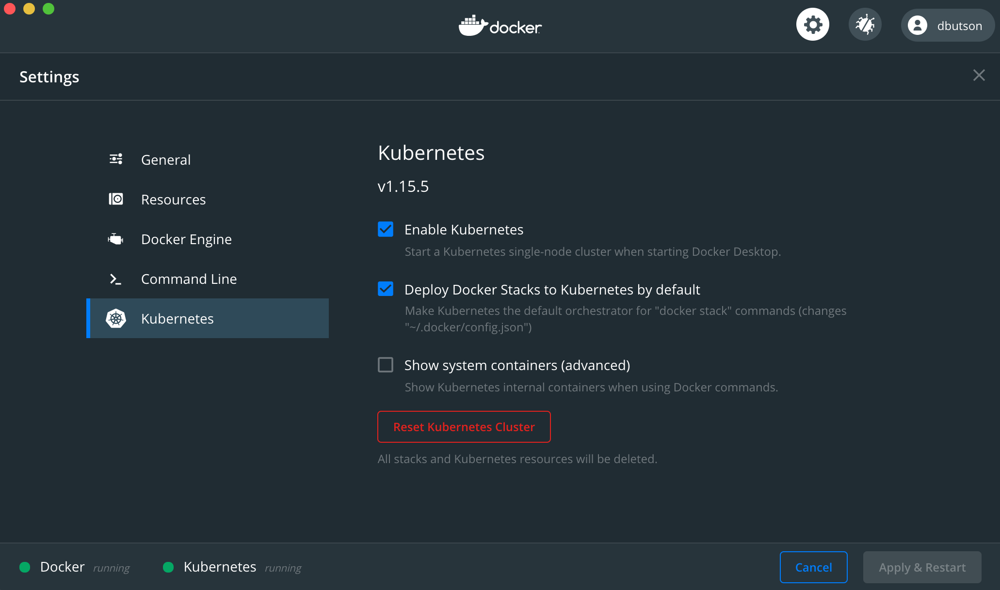

# NuoDB Dashboards - Influx Data Source

This repo contains the set of grafana dashboards for displaying
metrics published by nuoca to the output plugin InfluxDB for input
plugin NuoMon or NuoAdminNuoMon.

The dashboards are located in the conf sub directory.

A *docker stack* can be created with grafana, insights, and nuoca with
the configuration file **deploy/monitor-stack.yaml**.  nuoca can be
configured to point to either an existing nuoadmin or nuoagent
domain.  Or comment out, nuoca and deploy a batch.job to load an
existing `nuodbmgr monitor database` output file.  The output file can
be optionally be compressed.  An example exists in the data directory.

### Content:

| Directory | Description                                            |
|-----------|--------------------------------------------------------|
| conf      | dashboards and datasources for provisioning in grafana |
| data      | contains an example monitor file to demonstrate batch loading |
| deploy    | yaml configuration files for the monitor stack, nuoca setup and batch job for processing monitor output      |
| doc       | contains png included in this README |
| image     | scripts for batch processing, these are mounted into batch.job |


## Dashboards

The grafana dashboards and datasources are configured as used in the
docker stack in this repo.  This docker stack is created with the
basic installation of grafana.   If the dashboards are used in another
grafana installation some changes will need to be made to:

* **conf/provisioning/dashboards/nuodb.yaml**
* **conf/provisioning/datasources/nuodb.yaml**

For an explanation of these data files, see the grafana documentation
at
[grafana documentation on Provisioning](https://grafana.com/docs/grafana/latest/administration/provisioning/).

### Dashboards Configuration

`conf/provisioning/dashboards/nuodb.yaml` defines the location of the
dashboards.  I've chosen to store the dashboards in the same location
as the configuration file.  This is
*/etc/grafana/provisioning/dashboards* in the grafana docker container
or any default RPM install.

## Running Monitor Stack

To run the stack of grafana, influxdb, and nuoca you can use `docker stack`.

With _docker for desktop_ configure your docker stack to run in kubernetes.



You'll need to make some modifications to the compose file
**deploy/monitor-stack.yaml** that is used to define the monitor stack
and specifically the `nuoca:` section. 

  - not using nuoca

  ```yaml
  version: '3'
  services:
    ...

  #   nuoca:
  #      image: nuodb/nuodb-ce:latestn
  #      labels:
  #      - "owner=${USER}"
  #      environment:
  #      - NUODB_API_SERVER=http://nuoadmin.local:8888
  #      - NUODB_INSIGHTS_KEY=/etc/nuodb/keys/nuocmd.pem
  #      - DOMAIN_USER=domain
  #      - DOMAIN_PASSWORD=bird
  #      - DOMAIN_BROKER=nuoagent.local
  #      command: [ "nuoca", "start" , "nuoca", "--collection-interval", "10", "--config-template", "/tmp/nuoca.yml.template" ]
  #      volumes:
  #        - ../deploy/nuoca.yml.nuoadmin:/tmp/nuoca.yml.template
  ##        - ../deploy/nuocmd.pem:/etc/nuodb/keys/nuocmd.pem
  ##        - ../deploy/nuoca.yml.nuoagent:/tmp/nuoca.yml.template
  ```

  - using nuoca with nuoadmin without ssl

  ```yaml
  version: '3'
  services:
    ...

     nuoca:
        image: nuodb/nuodb-ce:latestn
        labels:
        - "owner=${USER}"
        environment:
        # change NUODB_API_SERVER
        - NUODB_API_SERVER=http://nuoadmin.local:8888 
        - NUODB_INSIGHTS_KEY=/etc/nuodb/keys/nuocmd.pem
        - DOMAIN_USER=domain
        - DOMAIN_PASSWORD=bird
        - DOMAIN_BROKER=nuoagent.local
        command: [ "nuoca", "start" , "nuoca", "--collection-interval", "10", "--config-template", "/tmp/nuoca.yml.template" ]
        volumes:
          - ../deploy/nuoca.yml.nuoadmin:/tmp/nuoca.yml.template
  #        - ../deploy/nuocmd.pem:/etc/nuodb/keys/nuocmd.pem
  #        - ../deploy/nuoca.yml.nuoagent:/tmp/nuoca.yml.template
  ```

  - using nuoca with nuoadmin with ssl

  ```yaml
  version: '3'
  services:
    ...

     nuoca:
        image: nuodb/nuodb-ce:latestn
        labels:
        - "owner=${USER}"
        environment:
        # change NUODB_API_SERVER
        - NUODB_API_SERVER=https://nuoadmin.local:8888 
        - NUODB_INSIGHTS_KEY=/etc/nuodb/keys/nuocmd.pem
        - DOMAIN_USER=domain
        - DOMAIN_PASSWORD=bird
        - DOMAIN_BROKER=nuoagent.local
        command: [ "nuoca", "start" , "nuoca", "--collection-interval", "10", "--config-template", "/tmp/nuoca.yml.template" ]
        volumes:
          - ../deploy/nuoca.yml.nuoadmin:/tmp/nuoca.yml.template
          - ../deploy/nuocmd.pem:/etc/nuodb/keys/nuocmd.pem
  #        - ../deploy/nuoca.yml.nuoagent:/tmp/nuoca.yml.template
  ```

  
  - using nuoca with nuoagent


  ```yaml
  version: '3'
  services:
    ...

     nuoca:
        image: nuodb/nuodb-ce:latestn
        labels:
        - "owner=${USER}"
        environment:
        - NUODB_API_SERVER=http://nuoadmin.local:8888 
        - NUODB_INSIGHTS_KEY=/etc/nuodb/keys/nuocmd.pem
        # change DOMAIN_USER, DOMAIN_PASSWORD, DOMAIN_BROKER
        - DOMAIN_USER=domain
        - DOMAIN_PASSWORD=bird
        - DOMAIN_BROKER=nuoagent.local
        command: [ "nuoca", "start" , "nuoca", "--collection-interval", "10", "--config-template", "/tmp/nuoca.yml.template" ]
        volumes:
  #        - ../deploy/nuoca.yml.nuoadmin:/tmp/nuoca.yml.template
  #        - ../deploy/nuocmd.pem:/etc/nuodb/keys/nuocmd.pem
          - ../deploy/nuoca.yml.nuoagent:/tmp/nuoca.yml.template
  ```

Once the compose files are correct you can deploy the stack in your local
kubernetes cluster with:

`docker stack deploy monitor -c deploy/monitor-stack.yaml`

To undeploy

`docker stack rm monitor`

Note, if you use *kubectl* to delete the deployments docker stacks
will reinstall.

Any data loaded is persisted in the directory lib/influxdb.  On
restart the data should still be available.  remove lib/influxdb to
reset the influx database.

## Loading Monitor Files 

To load a monitor file into Influx,  you will need to modify the
_deploy/load.yaml_ file. 

```yaml
apiVersion: batch/v1
kind: Job
metadata:
  name: load
spec:
  template:
    spec:
      containers:
      - name: load
        image: nuodb/nuodb-ce:latest
        args: [ "batch",  "-H", "influxdb", "/data/monitor-20200107-034803.log.gz" ]
        volumeMounts:
        - mountPath: /data
          name: mount-0
        - mountPath: /opt/nuodb/etc/nuoca/lib/batch.py
          name: mount-1
          subPath: batch.py
        - mountPath: /usr/local/bin/batch
          name: mount-1
          subPath: batch
      restartPolicy: Never
      volumes:
      - name: mount-0
        hostPath:
          path: /Users/dbutson/home/dev/nuodb-dashboards-influx/data
          type: ""
      - name: mount-1
        hostPath:
          path: /Users/dbutson/home/dev/nuodb-dashboards-influx/image
          type: ""
```

You will need to modify `args:` to your monitor filename, and the
`hostPath.path:` to the absolute path of the data and image
directories.  Put your monitor file in the data directory.

To run the batch job:

```
$ kubectl create -f deploy/load.yaml
```

To remove the deployment:

```
$ kubectl delete -f deploy/load.yaml
```
